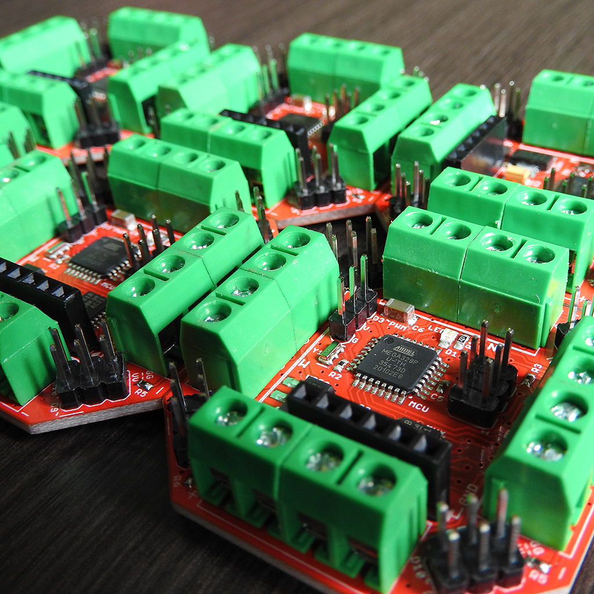

# The WindRose Project
Custom Hardware , Firmware and Software for Robotic Cellular Automata Experiments.

### We’re used to hearing about evolution by competition, but what about thinking about things that evolve from cooperation?

We can learn a lot about ourselves by simulating robotic beings communicating, sharing information, tools and interacting as a community of living beings. In these simulations, questions emerge such as the importance of synchronicity between beings, the need for a shared language for mutual understanding, among many other issues. That’s what this project and research is about.

Author: Sandro Benigno, thanks to fellow professor Marilia Lyra Bergamo for the inspiration and all the applied resources. 
She is the one who made this project possible and guided me by her research on Robotic Plants and Complexity Theories.

## The Wiki Pages

In the <a href="https://github.com/sandrobenigno/WindRose/wiki">wiki pages</a> you can learn about the board, including the pinout and its usage.

## Code documentation
All the files and classes are <a target="_blank" rel="noopener noreferrer" href="https://sandrobenigno.github.io/WindRose/html/index.html">documented here</a>.

## Fabrication

We fabricate the boards through Seeed Fusion PCB Assembly Service. Check how to <a href="https://github.com/sandrobenigno/WindRose/wiki/Fabricate-yours%21">fabricate yours!</a>

